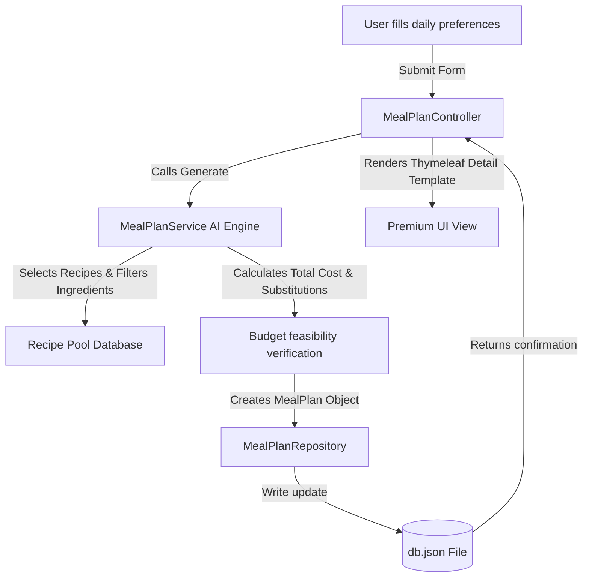

# Cooking To-Do List Application Architecture

This document details the system design, data structures, and implementation flow for the AI-driven macro cooking to-do list application.

---

## 1. System Overview

The Cooking To-Do List Application is a single-server web application featuring:
*   **Backend:** Java Spring Boot (v3.x) with Maven.
*   **Frontend:** Thymeleaf template engine styled with a premium, minimalist Netlify-like CSS design.
*   **Database:** A simple JSON file (`db.json`) located in the root folder, enabling data persistence without external database servers.

---

## 2. Directory Structure

```text
Prompt wars/
│
├── architecture/
│   └── architecture.md          # This architecture document
│
├── db.json                      # Local JSON file acting as database
├── pom.xml                      # Maven configuration
│
└── src/
    └── main/
        ├── java/
        │   └── com/
        │       └── cookingtodo/
        │           ├── CookingTodoApplication.java   # App entry point
        │           ├── controller/
        │           │   └── MealPlanController.java    # Web endpoints
        │           ├── model/
        │           │   ├── MealPlan.java             # Meal plan data model
        │           │   └── Preference.java           # User daily preferences
        │           ├── repository/
        │           │   └── MealPlanRepository.java   # JSON CRUD operations
        │           └── service/
        │               └── MealPlanService.java      # AI-driven meal planning engine
        │
        └── resources/
            ├── application.properties                # Spring boot configurations
            ├── templates/
            │   ├── index.html                        # Dashboard & input form
            │   └── detail.html                       # Individual plan walkthrough
            └── static/
                └── css/
                    └── style.css                     # Custom premium stylesheet
```

---

## 3. Data Models & JSON Schema

The application stores user-generated meal plans. Each meal plan represents a full day's food breakdown (Breakfast, Lunch, Dinner), shopping requirements, substitutions, and budget verification.

### JSON Database Schema (`db.json`)

The `db.json` file will contain a JSON array of `MealPlan` objects:

```json
[
  {
    "id": "550e8400-e29b-41d4-a716-446655440000",
    "createdAt": "2026-06-27T10:45:00Z",
    "preferences": {
      "dietaryGoal": "High Protein",
      "calorieTarget": 2000,
      "maxBudget": 30.00,
      "dislikedIngredients": ["Mushrooms"]
    },
    "meals": {
      "breakfast": {
        "name": "Protein-Packed Scrambled Eggs",
        "description": "Scrambled eggs with spinach, tomatoes, and whole wheat toast.",
        "macros": { "calories": 450, "protein": 30, "carbs": 25, "fat": 20 },
        "steps": [
          "Whisk 3 eggs with a splash of milk.",
          "Sauté spinach and tomatoes in a pan.",
          "Add eggs and scramble until firm.",
          "Toast whole wheat bread and serve."
        ]
      },
      "lunch": {
        "name": "Grilled Chicken Quinoa Salad",
        "description": "Sliced chicken breast over a bed of quinoa and cucumber salad.",
        "macros": { "calories": 650, "protein": 45, "carbs": 50, "fat": 15 },
        "steps": [
          "Grill chicken breast and slice.",
          "Boil quinoa according to package instructions.",
          "Toss quinoa, diced cucumber, and olive oil.",
          "Top with chicken slices and serve."
        ]
      },
      "dinner": {
        "name": "Baked Salmon with Broccoli",
        "description": "Garlic butter salmon fillet roasted with fresh broccoli florets.",
        "macros": { "calories": 700, "protein": 40, "carbs": 15, "fat": 45 },
        "steps": [
          "Preheat oven to 400°F (200°C).",
          "Season salmon and broccoli with garlic butter.",
          "Bake on a sheet pan for 15 minutes.",
          "Garnish with lemon and serve."
        ]
      }
    },
    "groceryList": [
      { "item": "Eggs", "quantity": "3 pcs", "estimatedCost": 1.50 },
      { "item": "Spinach", "quantity": "50g", "estimatedCost": 1.00 },
      { "item": "Tomatoes", "quantity": "1 pc", "estimatedCost": 0.50 },
      { "item": "Whole Wheat Bread", "quantity": "2 slices", "estimatedCost": 0.80 },
      { "item": "Chicken Breast", "quantity": "200g", "estimatedCost": 4.50 },
      { "item": "Quinoa", "quantity": "100g", "estimatedCost": 2.00 },
      { "item": "Cucumber", "quantity": "1 pc", "estimatedCost": 0.70 },
      { "item": "Salmon Fillet", "quantity": "200g", "estimatedCost": 9.00 },
      { "item": "Broccoli", "quantity": "1 head", "estimatedCost": 2.00 },
      { "item": "Garlic & Butter", "quantity": "Assorted", "estimatedCost": 1.50 }
    ],
    "substitutions": [
      { "original": "Salmon Fillet", "alternative": "Tofu (for a plant-based or cheaper protein)", "reason": "Reduces cost by $6.00 and fits vegetarian alternatives" },
      { "original": "Chicken Breast", "alternative": "Turkey Breast", "reason": "Similar lean protein profile and taste profile" }
    ],
    "budgetAnalysis": {
      "totalCost": 23.50,
      "maxBudget": 30.00,
      "isFeasible": true,
      "statusMessage": "Under budget by $6.50. Feasible!"
    },
    "aiInsights": "The AI recommended this plan to focus on lean proteins (Chicken, Salmon, Eggs) to satisfy your High Protein goal while staying well below your $30 budget. Disliked ingredients (Mushrooms) were strictly excluded."
  }
]
```

---

## 4. Key Logic & Workflow



### A. Meal Generation Engine
The service uses a curated recipe pool categorised by dietary profiles (High Protein, Vegan, Keto, Balanced, Low Cost). It filters out disliked ingredients listed by the user.

### B. Grocery & Budget Calculations
*   **Total Cost Calculation:** Sums the estimated costs of all ingredients in the grocery list.
*   **Feasibility Logic:** Checks if `totalCost <= maxBudget`. If the budget is exceeded, the system automatically flags the plan as **"Over Budget"**, visually alerts the user, and suggests cheaper ingredient substitutions (e.g., swapping Salmon for Canned Tuna or Tofu) to bring the cost down.

---

## 5. UI/UX Design System (Netlify-Style Minimalist)

To create a premium look, the design will employ:
*   **Typography:** Outfit or Inter fonts loaded from Google Fonts.
*   **Color Palette:**
    *   *Primary Dark Background:* HSL(220, 20%, 10%)
    *   *Card Backgrounds:* HSL(220, 20%, 15%) with a subtle border HSL(220, 20%, 25%)
    *   *Brand Accents (Netlify green/teal):* HSL(170, 75%, 45%) / `#00AD9F`
    *   *Budget Alert Positive:* HSL(145, 60%, 45%)
    *   *Budget Alert Warning:* HSL(350, 70%, 50%)
*   **Visual Highlights:**
    *   Cards with slight glassmorphism/shadow effects.
    *   Hover transition animations on cards and input fields.
    *   Collapsible sections for preparation steps.
    *   Interactive checkboxes for the shopping to-do list.
